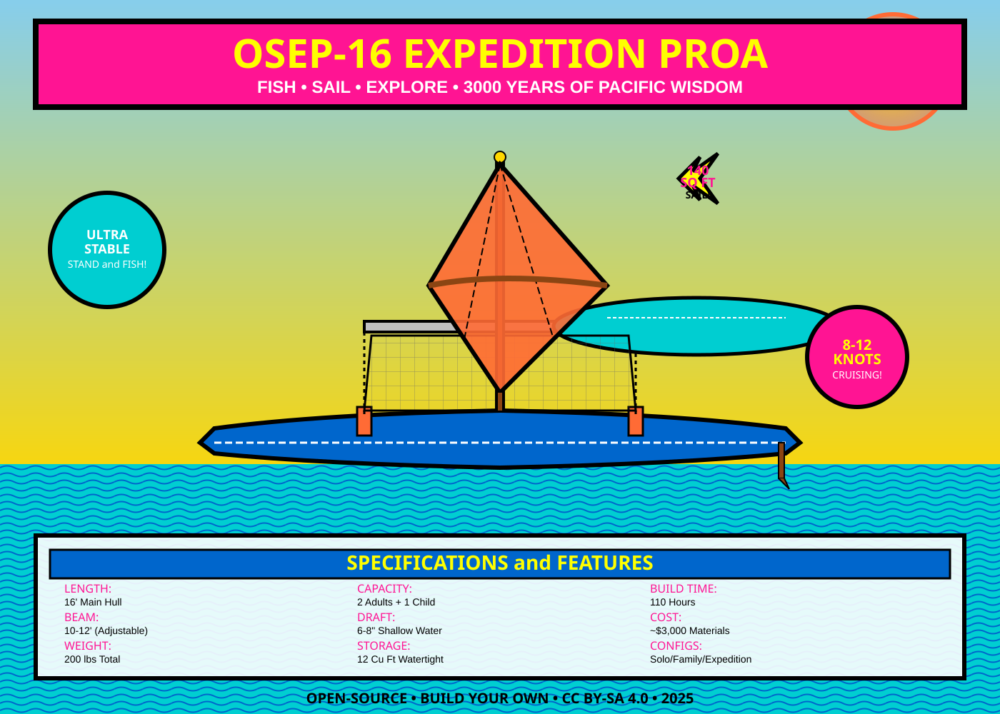

# Open-Source Expedition Proa

## 3000 Years of Ocean Wisdom, Reimagined for Modern Lakes

---

## The Problem

You want a boat that can:
- **Stand and fish** from a stable platform on a 1-acre pond
- **Sail with family** on lazy Sunday afternoons at the lake
- **Expedition camp** for multi-day trips with gear
- **Beach launch** without worrying about daggerboards or deep water
- **Build yourself** using modern CNC tools and open-source plans

**The Hobie 16 gets close... but it's a racing catamaran, not a fishing platform.**

---

## The Solution: Modern Expedition Proa

We took 3000 years of Pacific Islander proa design, combined it with modern materials and CNC manufacturing, and created something better than a Hobie 16 for YOUR use case.

### What's a Proa?

A proa is a sailing canoe with a single outrigger (ama) that stays on one side. Instead of tacking through the wind, the boat **reverses direction** - both ends are identical. Think of it as having a boat with two bows.

**Historical proof:** Micronesian navigators used proas to cross thousands of miles of open ocean. European explorers in the 1500s were stunned by their speed and efficiency.

**Modern advantage:** We can make the ama a modular platform - use it for fishing, storage, or family seating depending on your mission.

---

## Why Proa Beats Catamaran (for Lakes)

| Feature | Hobie 16 Catamaran | OSEP-16 Proa |
|---------|-------------------|--------------|
| **Fishing stability** | Moderate (designed for racing) | **High** (ama = casting platform) |
| **Standing capability** | Trapeze wire only | **Ama deck + trampoline** |
| **Shallow water** | 10" draft | **6-8" draft** |
| **Modularity** | Fixed configuration | **3 modes: solo/family/expedition** |
| **Expedition storage** | Minimal (under trampoline) | **12 cu ft watertight ama** |
| **Beach launching** | Yes (banana hulls) | **Yes (less draft, easier)** |
| **Build method** | Fiberglass molds ($$$) | **CNC stitch-and-glue** |
| **Cost** | $8,000+ new | **<$3,000 DIY** |
| **Open source** | Proprietary design | **Fully open, CC BY-SA** |

---

## Three Configurations, One Hull

### 1. Solo Fishing Mode
**Remove the ama, sail the main hull solo.**

- Main hull becomes stable sit-on-top kayak
- Paddle or small sail (80 sq ft)
- Stand in hull to cast
- Rod holders flush-mounted
- Weight: 85 lbs (fits in pickup bed)

Perfect for: Fly fishing at Eleven Mile Reservoir, quiet mornings on county lakes

---

### 2. Family Day Sailing
**Full proa rig: main hull + ama + trampoline**

- 2 adults on trampoline, 1 child on ama or trampoline
- 140 sq ft crab claw sail
- Shunt instead of tack (easier for beginners)
- Speed: 8-12 knots in moderate wind
- High stability, low capsize risk

Perfect for: Sunday afternoon at the lake, teaching kids to sail, relaxing cruises

---

### 3. Expedition Camping
**Full rig with sealed ama for gear storage**

- 12 cubic feet of watertight storage in ama
- Sleep on trampoline or beach camp
- 50+ mile range per day
- 3-5 day provisions capacity (solo)
- Beach landing anywhere

Perfect for: Multi-day Grand Lake expeditions, exploring remote coves, adventure camping

---

## Design Highlights

### Asymmetric Main Hull
- **Leeward side (flat):** Superior tracking, no daggerboard needed
- **Windward side (rounded):** Speed and wave handling
- **Both ends identical:** Shunting design, no "stern"
- **16 feet long, 24 inches wide**

### Modular Ama (Outrigger)
- **12 feet long, 18 inches wide**
- **Buoyant platform:** 400 lbs reserve flotation
- **Watertight storage:** Removable hatch, 12 cu ft volume
- **Standing deck:** Fish from ama in calm conditions

### Adjustable Crossbeams (Akas)
- **8-12 foot beam adjustment**
- **Aluminum or carbon fiber**
- **Quick-release pylons** (Hobie-style attachment)
- **Trampoline area:** 8' x 10'

### Simple Crab Claw Sail
- **Unstayed mast** (no shrouds to adjust)
- **140 sq ft Dacron sail**
- **Traditional curved yard** OR modern lateen variant
- **4:1 sheet system**
- **Shunting:** Reverse sail end-for-end

---

## Build It Yourself: CNC + Stitch-and-Glue

### Why This Method?

**Traditional fiberglass catamarans** require expensive molds and skilled laminating. We use **stitch-and-glue plywood construction** optimized for CNC cutting.

**Advantages:**
- Cut all panels on 4'x8' sheets (standard plywood)
- Assemble with copper wire + epoxy (no molds)
- Lightweight, strong, repairable
- Perfect for first-time builders

### Build Stats
- **Time:** ~110 hours (solo, moderate experience)
- **Cost:** ~$2,990 (materials only)
- **Plywood:** 6 sheets 4'x8' marine ply
- **Epoxy:** 5-gallon kit
- **Hardware:** Aluminum tubes, stainless fasteners, Dacron sail

### CNC Cut Files Included
- **Main hull:** 8 panels, nested on 3 sheets
- **Ama:** 6 panels, nested on 2 sheets
- **Bulkheads:** 6 pieces, nested on 1 sheet
- **Total waste:** <15%
- **Formats:** DXF, SVG, STEP, STL

---

## Historical Foundation

### Pacific Proas: 3000 Years of Evolution

The proa isn't new - it's **the most refined sailing design in human history.**

**Micronesian Origins (1500 BCE - Present):**
- CHamoru people of Mariana Islands built 52-foot flying proas
- Symmetrical ends allowed shunting (no tacking needed)
- Asymmetric hulls with flat leeward side for stability
- Crab claw sails optimized for Pacific trade winds
- Navigators crossed 2000+ miles of open ocean

**European Discovery (1521):**
- Magellan's crew encountered Micronesian proas
- Estimated speed: **20 mph** (32 km/h) - faster than any European ship
- British explorer Anson (1742) made detailed drawings
- Sparked 200+ years of Western proa experimentation

**Modern Racing Proas:**
- Dick Newick's "Cheers" (1968): 3rd place OSTAR transatlantic race
- Proved proa design viable for extreme offshore conditions
- Modern variants hold speed-sailing records

**Why We Learn From History:**
- Proas solved stability, speed, and shallow-draft challenges **3000 years ago**
- Western catamarans are the "new" design (1960s popularization)
- We're not inventing - we're standing on the shoulders of giants

[Read full history →](/history/)

---

## Modern Materials + Ancient Wisdom

### What We Keep From Tradition:
- Asymmetric hull (flat leeward, rounded windward)
- Shunting maneuver (reversible ends)
- Outrigger stability system
- Crab claw sail geometry
- Minimal draft for beach landing

### What We Modernize:
- CNC-cut marine plywood (vs. carved logs)
- Epoxy/fiberglass (vs. tree sap/caulking)
- Aluminum crossbeams (vs. lashed wood)
- Dacron sails (vs. woven pandanus leaves)
- Modular design (3 configurations)

---

## Download Everything

### CAD Models
- **STEP files:** Main hull, ama, bulkheads
- **STL files:** 3D printable components
- **FreeCAD source:** Fully parametric, editable

### CNC Cut Files
- **DXF format:** Import into any CAM software
- **SVG format:** Laser cutting / visualization
- **G-code:** Pre-generated toolpaths (verify before use)
- **Nesting diagrams:** Optimal 4'x8' sheet layout

### Build Documentation
- **Assembly manual:** IKEA-style step-by-step (PDF)
- **Configuration guides:** Solo/family/expedition (PDF)
- **Rigging diagrams:** Sail setup, shunting procedure
- **Safety protocols:** Launch, capsize recovery, weather limits

### Bill of Materials
- **Complete parts list:** Plywood, epoxy, hardware, sail
- **Supplier recommendations:** Where to buy materials
- **Cost calculator:** Estimate your build budget
- **Tool list:** What you need (CNC optional)

[Go to Downloads →](/assets/downloads/)

---

## CNC Mill Build (Optional)

Don't have a CNC mill? We've got you covered.

### Option 1: Access a CNC
- Makerspaces, community colleges, fab labs
- Cost: $50-150/hour (8-12 hours total cutting)
- Bring USB with cut files

### Option 2: Build Your Own
- **4'x8' capable mills:** $2,500 - $8,000
- **Our recommended build:** Semi-professional gantry router
- **Plans included:** CNC mill design documentation
- **Dual use:** Cut boat parts, then use for future projects

### Option 3: Hand Tools
- All plans include hand-cut templates
- Jigsaw + sander = totally viable
- Adds ~20 hours to build time

[CNC Build Guide →](/build-guides/cnc-machine.html)

---

## Open Source = Community Innovation

### Why Open Source?

We release everything under **Creative Commons BY-SA 4.0** because:

1. **You own your build** - no licensing fees, no restrictions
2. **Community improves design** - share mods, test results, failures
3. **Standing on shoulders** - Micronesian sailors didn't patent proas
4. **Funding through transparency** - show your work, build trust

### How to Contribute

- **Build one and document it** - photos, videos, lessons learned
- **Test modifications** - ama variations, sail rigs, fishing gear
- **Improve CAD** - optimize nesting, reduce weight, add features
- **Translate docs** - make accessible worldwide
- **Fund development** - sponsor prototyping, testing, documentation

[Join Community Forum →](https://github.com/your-design/hobby-sailing-craft/issues)

---

## Project Status

**Current Phase:** Design & Documentation (Alpha 0.1.0)

**Completed:**
- ✅ Design thesis validated
- ✅ Historical research compiled
- ✅ Technical specifications finalized
- ✅ Jekyll site architecture live
- ✅ Performance targets defined

**In Progress:**
- 🔨 CAD modeling (main hull, ama, crossbeams)
- 🔨 CNC nesting optimization
- 🔨 Assembly manual drafting
- 🔨 Historical deep-dive articles

**Upcoming:**
- ⏳ Prototype build #1 (physical validation)
- ⏳ On-water testing
- ⏳ Community feedback integration
- ⏳ Production-ready plans release

[View Roadmap →](https://github.com/your-design/hobby-sailing-craft)

---

## Start Building

### Quick Start
1. **Read the design thesis** → Understand why proa
2. **Study historical context** → Learn from 3000 years
3. **Download CAD files** → Inspect the design
4. **Estimate your build** → Materials, time, tools
5. **Join the forum** → Ask questions, share plans
6. **Cut your first panel** → Start building

### Need Help?
- **Community forum:** Ask questions, share progress
- **Email:** contact@expedition-proa.org
- **Video tutorials:** Coming soon
- **Build logs:** Follow others' builds

---

## Vision

**We're building more than a boat.**

We're creating a **movement** - where modern makers stand on the shoulders of ancient navigators, where CNC mills cut shapes refined over millennia, where open-source collaboration honors the spirit of Pacific Islander knowledge-sharing.

**The OSEP-16 is the first step.** 

Next: Larger expedition proas for Great Lakes and coastal sailing. Trimaran variants. Educational programs teaching traditional navigation and modern fabrication.

**Join us.**

---

[Download Files](/assets/downloads/) | [Read History](/history/) | [View Designs](/designs/) | [Build Guides](/build-guides/) | [Community Forum](https://github.com/your-design/hobby-sailing-craft/issues)

---

*Open-Source Expedition Proa Project*  
*Licensed under Creative Commons BY-SA 4.0*  
*Version 0.1.0-alpha | Last updated: November 2025*
